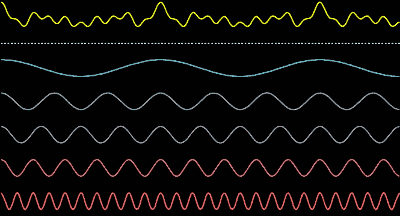

# But what is the Fourier Transform? A visual introduction.

The central example, to start, is gonna be the classic one: Decomposing frequencies from sound. 

This sound right here is a pure A , 440 beats second. Meaning, if you were to measure the air pressure, right next to your headphones, as a function of time, it would oscillate up and down around its usual equilibrium, in this wave, making 440 oscillations each second. 

A lower-pitched note, like a D, has the same structure, just fewer beats per second. (D294)

And the both of them are played at once, what do you think the resulting pressure-time graph looks like ?  the pressure is gonna be the sum of what it would be for each of those notes individually.  Now what you get is a wave-ish pressure-time graph, that is not a pure sine wave, it's something more complicated.

And as you add in other notes, the wave gets more and more complicated. But right now, all it is a combination of pure frequencies.  A microphone recording any sound just picks upon the air presure at many different points in time, it only see the final sum.  So our central question is gonna be how you can take a signal like this, de decompose it into the pure frequencies that make it up.

The general strategy is gonna be to build for ourselves a mathematical machine that treats signals with a given frequency differently from how it treats other signals. 

To start, consider simply taking a pure signal, say, with a lowly 3 beats per second. 

And let's limit ourselves to looking at a finite portion of this graph, in this case, the portion between 0 seconds and 4.5 seconds.

The key idea is gonna be to take this graph, and sort of wrap it up around a circle. Concretely, here's what I mean by that, imagine a little rotating vector where each point in time its length is equal to the height of graph for that time. 

So, high points of the graph correspond to a greater distance from the origin, and low points end up closer to the origin.

And right now, I'm drawing it in such a way that moving forward 2 seconds in time corresponds to a single rotation around the circle. Our little vector drawing thit round graph is rotating at half a cycle per second. ( 2秒钟，旋转向量正好旋转了1圈 ) 

So, this is important. There are two different frequencies at play here:  

 1. There's the frequency of our signal, which goes up and down, 3 times per second. 
 2. Separately , there's the frequency with which we're wrapping the graph around the circle , is half a cycle per second. 

But we can adjust that second frequency however we want. Maybe we want to wrap it around faster or slower.  And that choice of winding frequency determines what the round graph looks like. 

And at this point, we might have some sort of vague sense that something special will happen, when the winding frequency matches the frequency of our signal: 3 beats per second,  and  3 cycles per second. 

All the high points on the graph happen on the right side of the circle.  And all of the low point .

But how preciesly can we take advantage of that in our attempt to build a frequency-unmixing machine ?

Well, imagine this graph is have some kind of mass to it, like a metal wire. This little dot is going to represent the center of mass of that wire. As we change the frequency, and the graph winds up differently, that center of mass kind of wobbles around a bit.

And for most of the winding frequencies, the peaks and valleys are all spaced out around the circle in such a way that the center of mass stays pretty close to the origin. 

But, when the winding frequency is the same as the frequency of our signal, in this case, 3 cycles per second, the center of mass is unusually far to the right. 

Here, to capture this, let's draw some kind of plot that keeps track of where that center of mass is for each winding frequency. Of course, the center of mass is a 2D thing, but for the moment, let's only keep track of the x coordinate. 

