...menustart

 - [But what is the Fourier Transform? A visual introduction.](#cca32b346dc008638fca79b78f457504)
 - [什么是傅立叶变换](#b46cd00ce66cf213faa8731568d09839)
     - [傅立叶级数](#f638045f1760eebb183feb59937fd197)
     - [连续傅立叶变换](#87f152e061070fbeb8bf2d97f37a75e6)

...menuend

<h2 id="cca32b346dc008638fca79b78f457504"></h2>

-----
-----

# But what is the Fourier Transform? A visual introduction.

The central example, to start, is gonna be the classic one: Decomposing frequencies from sound. 

This sound right here is a pure A , 440 beats second. Meaning, if you were to measure the air pressure, right next to your headphones, as a function of time, it would oscillate up and down around its usual equilibrium, in this wave, making 440 oscillations each second. 

A lower-pitched note, like a D, has the same structure, just fewer beats per second. (D294)

And the both of them are played at once, what do you think the resulting pressure-time graph looks like ?  the pressure is gonna be the sum of what it would be for each of those notes individually.  Now what you get is a wave-ish pressure-time graph, that is not a pure sine wave, it's something more complicated.

And as you add in other notes, the wave gets more and more complicated. But right now, all it is a combination of pure frequencies.  A microphone recording any sound just picks upon the air presure at many different points in time, it only see the final sum.  So our central question is gonna be how you can take a signal like this, de decompose it into the pure frequencies that make it up.

The general strategy is gonna be to build for ourselves a mathematical machine that treats signals with a given frequency differently from how it treats other signals. 

To start, consider simply taking a pure signal, say, with a lowly 3 beats per second. 

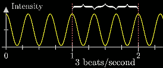

And let's limit ourselves to looking at a finite portion of this graph, in this case, the portion between 0 seconds and 4.5 seconds.

The key idea is gonna be to take this graph, and sort of wrap it up around a circle. Concretely, here's what I mean by that, imagine a little rotating vector where each point in time its length is equal to the height of graph for that time. 

So, high points of the graph correspond to a greater distance from the origin, and low points end up closer to the origin.

And right now, I'm drawing it in such a way that moving forward 2 seconds in time corresponds to a single rotation around the circle. Our little vector drawing thit wound up graph is rotating at half a cycle per second. ( 2秒钟，旋转向量正好旋转了1圈 ) 

So, this is important. There are two different frequencies at play here:  

 1. There's the frequency of our signal, which goes up and down, 3 times per second. 
 2. Separately , there's the frequency with which we're wrapping the graph around the circle , is half a cycle per second. 

But we can adjust that second frequency however we want. Maybe we want to wrap it around faster or slower.  And that choice of winding frequency determines what the wound up graph looks like. 

And at this point, we might have some sort of vague sense that something special will happen, when the winding frequency matches the frequency of our signal: 3 beats per second,  and  3 cycles per second. 

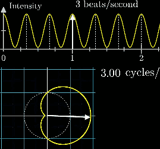

All the high points on the graph happen on the right side of the circle.  And all of the low point .

But how preciesly can we take advantage of that in our attempt to build a frequency-unmixing machine ?

Well, imagine this graph is have some kind of mass to it, like a metal wire. This little dot is going to represent the center of mass of that wire. As we change the frequency, and the graph winds up differently, that center of mass kind of wobbles around a bit.

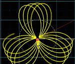

And for most of the winding frequencies, the peaks and valleys are all spaced out around the circle in such a way that the center of mass stays pretty close to the origin. 

But, when the winding frequency is the same as the frequency of our signal, in this case, 3 cycles per second, the center of mass is unusually far to the right. 

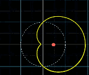

Here, to capture this, let's draw some kind of plot that keeps track of where that center of mass is for each winding frequency. Of course, the center of mass is a 2D thing, but for the moment, let's only keep track of the x coordinate. 

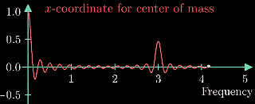

At 3beats/s , there's a spike as everything lines up to the right. 

By the way, let's look back at those really low frequencies near 0. This big spike around 0 in our new frequency plot just corresponds to the fact that the whole cosine wave is shifted up. If I chosen a signal oscillates around 0, dipping into negative values, then , as the plot for the center of mass will only have a spike at the value of 3. 

But, negative values are a little bit weird and messy to think about, especially for a first example, so let's just continue to thinking in terms of the shifted-up graph. Our main focus, as far as frequency decomposition is concerned,  is that bump at 3. 

The whole plot is what I called the "Almost Fourier Transform" of the original signal.  There's a couple small distinctions between this and the actual Fourier transform. 

You might be able to see how this machine lets us pick out the frequency of a signal.  Now take a different pure signal, let's say with a lower frequency of 2 beats /s, and do the same thing. 

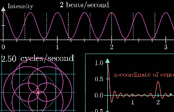

The real key point, the thing that makes this machine so delightful, is how it enables us to take a singal consisting of multiple frequencies, and pick out what they are. 

Imagine taking the 2 signals we just looked at, 2 beats/s, 3 beats/s , and add them up , and see what our machine tells us.

Now what's going on here with the 2 different spikes, is that if you were to take 2 signals, and then apply this almost-fourier transfrom to each of them individually, and then add up the result, what you get is the same as if you first added up the signals and then applied this Almost-Fourier transform.

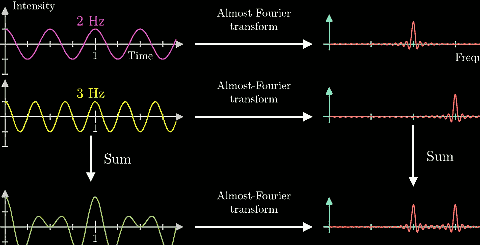

---

Before continuing into the full match that describes this operation, let's just get a quick glimpse of one context where this thing is useful: Sound editing. 

Let's say that you have dome recording , and it's got an annoying high pitch that you'd like to filter out. Well, at first, your singal is coming in as a function of various intensities over time. When you take the Fourier transform of that signal, the annoying high pitch is going to show up just as a spike at some high frequency. 

To filter that out, just smush the spikedown. 

Luckily, there's a notion of an inverse Fourier transform , that would give you back the signal without that annoise.

But long story short, applying the Fourier transform to the Fourier transform gives you back something close to the original function. It's a little bit of a lie, but it's in the direction of the truth. 

---

Bring back this wound up graph , and looking at its center of mass, the x coordinate is really half the story. The thing is in 2D , it's got a y coordinate as well.And as is typical math, whenever you're dealing with something 2D, it's elegant to think of it as the complex plane, where this center of mass is gonna be a complex number. 

The reason for taking in terms of complex numbers, is that complex numbers lend themselves to really nice descriptions of things that have to do with winding and rotation. For example, Euler's formula famously tells us that if you take e to some number times i, you're gonna land on the point that you get if you were to walk that number of units around a circle with radius 1, counter-clockwise starting on the right. 

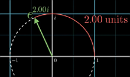

So , imagine you wanted to describe rotating at a rate of one cycle per second,  one thing you can do is to take the expression e2πit , where t is the amount of time that has past.   Maybe you wanna describe a different frequency, something lower and more reasonable, and for that, you would just multiply time t by the frequency f, e2πit .   For example, if f was 1/10, then this vector make one full turn every 10 seconds. 

Now why am I telling you this , you might ask. It gives us a really nice way to write down the idea of winding up the graph into a single, tight little formula. First off, the convention in the context of Fourier transforms is to think about the rotating in the clockwise direction , so let's go ahead and throw a negative sign up into the exponent e-2πift .  Now, take some function describing a signal, like pure cosine wave , and call it g(t) , if you multiply this exponential expression time g(t) ,  g(t)·e-2πift, it means that the rotaing complex number is getting scaled up and down according to the value of g(t).

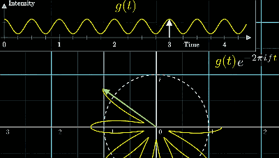

So you can think of this little rotating vector with its changing lenght  as drawing the wound up graph. This is awesome. This really small expression is a super-elegant way to encapsulate the whole idea of winding a graph around a circle with a variable frequency f.  

And remember , that thing we want to do this wound up graph is to track its center of mass. So think about what formula is going to capture that. 

Well, to approximate it at least, you might sample a whole bunch of times from the original signal, see where those points end up on the wound up graph, and then just take an average. 

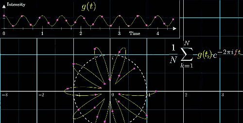

This will become more accurate if you sample more points which are closer together. And in the limit, you take an integral of this funcion , divided by the size of the time inteval.  

Now the idea of integrating a complex-valued function might seem weird, but the underlying meaning here really doesn't require any calculus knowledge. The whole expression is just the center of mass of the wound up graph.  
 

Great, step-by-step, we have built up this surprisingly small expression, for the whole winding machine idea. And now there is only 1 final distinction to point out between this and the actual, honest-to-goodness Fourier transform. Namely, just don't divide out by the time interval. The Fourier transform is just the integral part of this. What that meas is that instead of looking at the center of mass, you would scale it up by some amount.  If the portion of the original graph spanned 3 second, you would multiply the center of mass by 3. 

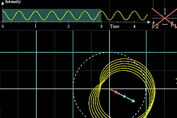

Physically , this has the effect that when a certain frequency persists for a long time, then the magnitude of the Fourier transform at that frequency is scaled up more and more. 

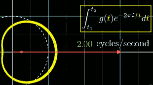

For example, what we're looking at right here is how when you have a pure frequency of 2 beats/s, and you wind it around the graph at 2 cycles/s , the center of mass stays in the same spot. It's just tracing out the same shape. The longer that signal persists, the larger the value of the Fourier transform , at that frequency. For other frequencies, though, even if you just increase it a bit, this is cancelled out by the fact that for longer time intervals, you're giving the wound up graph more of a chance to balance itsefe around the circle.

---

Let's summarize what we have so far.

The fourier transform of an intensity / time function, like g(t), is a new function, which doesn't have time as an input , but instead takes in a frequency, called "the winding frequency". Let's call this function as ĝ(f).  The output of this function is a complex number, some point in the 2D plane, that corresponds to the strength of a given frequency in the original signal. The plot that I've been graphing for the fourier transform is just the **real** component of that output, the x-coordinate. But you could also graph the imaginary component separately, if you wanted a full description. 

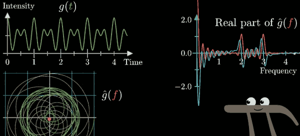

And all of this is being encapsulated inside that formula that we built up. 

Btw, one quick small note before we can call this wrapped up. Even though in practice , with things like sound editing, you'be integrating over a finite time interval , t1 to t2, the theory of Fourier transform is often phrased where the bounds of this integral are -∞ to ∞ .  Concretely, what that means is that you consider this expression for all possible finite time intervals, and you just ask, "What is its limit as that time interval grows to ∞?"  

----

<h2 id="b46cd00ce66cf213faa8731568d09839"></h2>

-----
-----

# 什么是傅立叶变换

其实分为两部分:  1. Fourier 级数  2. 连续 Fourier 变换

<h2 id="f638045f1760eebb183feb59937fd197"></h2>

-----

## 傅立叶级数

任何一个周期性的函数, 都可以表示为 一些列 正(余)弦函数的和。

我们把一个时域的信号，做了傅立叶变换之后， 会变换成3个内容.

 1. 一系列的频率
 2. 频率的振幅
 3. 每个频率的相位

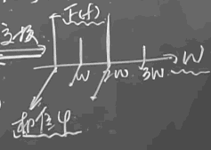

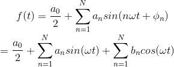

标准正交积  1,sin(ωt),cos(ωt) ？ 在傅立叶变换中，内积的定义是一种积分，比较复杂。

<h2 id="87f152e061070fbeb8bf2d97f37a75e6"></h2>

-----

## 连续傅立叶变换

如何处理非周期性函数?

复数坐标系:  cosθ + isinθ

欧拉公式:  cosθ + isinθ  = eiθ

令 θ=ωt ,  ω是频率，t是时间

eiωt  就是 代表 逆时针旋转， 每时每刻都代表了一种正交基的一个组合。

e-iωt  就是表示 顺时针旋转。

有了这些以后，我们就可以对一个函数进行傅立叶变换了。

如果一个信号没有周期性，但是可以看作是一个周期为无穷大的函数， 可以分出一大堆的各种频率信号来。 我们根据标准正交基的含义， 假如 这里面有一个频率是 ω 的sin信号,  我们用 sin去乘， 就会把这个信号给 乘出来， 而其他的这些 cos 分量都会弄没。 

所以，我们做一个内积，这个内积是积分形式，

FT变换之后， 实部 代表频率， 虚部，代表相位。

傅立叶逆变换:

应用：

1. 声音处理
    - 傅立叶变化， 低频部分，是女声，中频部分，是男声， 更高频部分，噪音
2. 图像处理 
    - 横坐标可以是时间，也可以是位置。 如果是位置，那就变成一个图像了。
    - 现在有一个人像， 脸上有斑点，我现在要进行磨皮，怎么办 ？  做傅立叶变换。 
    - 做了傅立叶变换之后，这个图就变成像一个衍射图一样了。  低频成分，表示这个人的轮廓，就是脸，腿之类的。 高频成分，表示细节，比如 眼睛，皱纹， 斑点。
    - 过滤掉高频，这些细节就没有了。

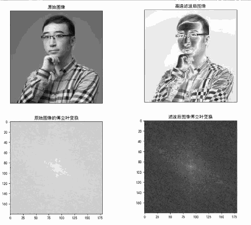

