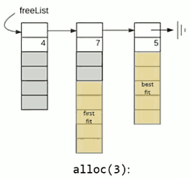
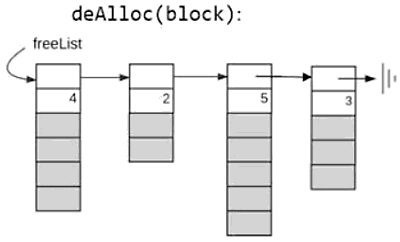

# Module 6: Operating System

## 6.1 Operating System 

### Typical OS Services 

 - Language extensions / standard library
    - mathematical operations (abs,sqrt,...)
    - abstract data types (String, Array, ...)
    - input function  (readChar, readLine, ...)
    - textual output (printChar, printString, ...)
    - graphics output (drawLine, drawCircle, ...)
 - System oriented services 
    - memory management (objects, arrays, ...)
    - file system
    - I/O device drivers
    - UI management (shell, windows)
    - multi-tasking 
    - Networking 
    - security 

### The Jack OS

 1. Math
 2. Memory
 3. Screen
 4. Output
 5. Keyboard
 6. String
 7. Array
 8. Sys


## 6.3 Mathematical Operations

### multiplcation 

- naive implement
    - repeative additon  , O(N)
- optimized solutino
    - binary shift , and then sum up , O(w)


 - Issues:
    - how to handle negative numbers ?
        - it works fine
    - how to handle overflow ?
        - this algorithm always return the correct answer modulu 2ʷ
    - how to implement i'th bit of y quickly ?
        - Jack doesn't have bit test function 
        - Instead, we can use an array that holds the 16 values 2ⁱ, i=0,...,15
            - a fixed array, say , twoToThe[i]
            - implement the bit test function


### Division

```
// return the integer part of x/y
// where x >=0 , and y >0
def divide(x,y):
    if y > x :
        return 0
    q = divide(x, 2*y)
    if x - 2*y*q < y :
        return 2*q
    else:
        return 2*q + 1
```

 - O(logN)
 - Issues:
    - handling negative numbers
        - divide |x| / |y|
        - then set the result's sign
    - handling overflow (of y)
        - solution: the overflow can be detected when y becomes negative 
        - we can change the functions first statement to:
            - `if (y>x or y<0) return 0`
 
### Square root

 - The square root function √x has 2 appealing properties:
    - its inverse function x² can be easily computed
    - it is a monotonically increasing function
 - Therefore:
    - squre roots can be computed using *binary search*
 - Issus:
    - the calculation of   `(y+2ʲ)²` can overflwo
    - solution: change the condition  `(y+2ʲ)²<=x`  to `(y+2ʲ)² <=x and (y+2ʲ)² >0`


## 6.4 Memory Access

 - class Memory 
    - int peek(int addr)
    - void poke(int addr, int value)
    - Array alloc(int size)
    - void deAlloc(Array o)

 - The challenge 
    - THe OS is written in Jack: how can we access the RAM ?
    -
    ```
    class Memory {
        static array ram;
        ...
        function void init() {
            let ram = 0 ;  // Jack is weak typed
        }
    }
    ```

## 6.5 Heap Management 

 - The need
    - During run-time , programs typically create objects and arrays
    - Objects and arrays are implemented using 
        - reference variables
        - pointing at actual data blocks (in the heap)
 - The challenge
    - Allocating memory for new objects / arrays 
    - Recycling memory of disposed objects / arrays 

### Object construction and destruction 

 - The challenge 
    - Implementing *alloc* and *dealloc*
 - The solution 
    - Heap management 

### Heap management (simple)

```
init:
    free = heapBase
    
alloc(size):
    block = free
    free = free + size
    return block

deAlloc(object):
    do nothing (simple, never recycle)
```

### Heap management 

 - Use a **linked list** to keep track of available heap segments , which are presently available to us
    - 
 - alloc(size):
    - find a block of size *size* in one of the segments ,remove it from the segment , and give it the client 
 - deAlloc(object):
    - append the object/block to the freeList ( i.e. simply append it to the end of the freeList.  )


### Heap management (detailed)

 - alloc(size):
    - for an example,  *size* = 3
    - Terminology: if segment size >= *size* + 2 , we say that the segment is *possible*
        - The *2*  is for the overhead fields which are absolutely necessary. 
    - search the freeList for:
        - the first possible segment (first fit) , or 
        - the smallest possible segment (best fit) 
    - 
    - if no such segment is found, return failure (or attempt defragmentataion)
    - carve a block of size ( *size* + 2 ) from this segment 
        - update the freeList and the fields of *block* to account for the allocation
    - return the base address of the block's data part 
    - 
 - deAlloc (object):
    - append *object* to the end of the freeList. 
    - 
    - problem:  The more we recycle (deAlloc), the more the freeList becomes fragmented.
    - defrag: every once defrag kicks in, it go through the entire freeList, and tries to merge as more small segments into continuous segments in the memory.
        - not required for this course project.


### Implementation notes

 - Implementing the heap / freeList (on Hack platform)

```
class Memory {
    ...
    static Array heap;
    ...

    // In Memory.init 
    ...
    let heap = 2048; // heapBase

    let freeList = 2048;
    let heap[0] = 0 // next, 0 means its tail of freelist
    let heap[1] = 14335; // length
    ...
}
```

 - The *freeList* can be realized using the *heap* array
 - The *next* and *size* properties of the memory segment beginning in address *adrr* can be realized by `heap[addr-2]` and `heap[addr-1]`.
 - alloc, deAlloc, and deFrag can be realized as operations on the *heap* array.


## 6.6 Graphics


### Draw Pixel

 - recap
    - 8k screen memory map 
    - target screen:   512 pixel * 256 pixel 
    - Jack word:  16 bits

```
function void drawPixel(int x, int y) {
    address = 32*y + x/16 
    value = Memory.peek[ 16384 + address ]
    set (x%16)th bit of value to 1
    do Memory.poke(address, value)
}
```


### Line Drawing

 - Basic idea: image drawing is implemented through a sequence of *drawLine* operations
 - Challenge: draw lines *fast*
 - Naive idean: 

```
// just for an example
// assuming x2 > x1, y2 > y1
drawLine(x1,y1, x2,y2)
let:
    x = x1
    y = y1
    dx = x2 - x1
    dy = y2 - y1

a = 0 ; b = 0 ;
while ( (a<=dx) and (b<=dy) )
    drawPixel( x + a, y + b )
    // decide if to go right , or up
    // to avoid going diagonally
    if ( b/a > dy / dx ) , a = a + 1 
    else           , b = b + 1 

```

 - opitmize:
    - `( b/a > dy / dx )` has the same value as `( a*dy < b*dx )`
    - `let diff = a*dy - b*dx`
        - when a = a + 1 , *diff* goes up by **dy**
        - when b = b + 1 , *diff* goes down by **dx**
    - solution:
        - 
        ```
        if (diff < 0 ) 
            a = a + 1
            diff = diff + dy 
        else
            b = b + 1
            diff = diff - dx 
        ```
    - now , it involves only addition and subtraction operations 
        - and can be implemented either in software or hardware.


### Circle drawing 


