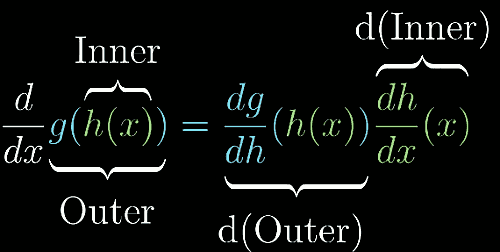

...menustart

 - [chapter 1: Essense of Calculus](#5c6d0419bdcc965d881019d989ad6f1a)
 - [chapter 2: Paradox of the derivatives](#b872997f4e311706ca6628e823fc3459)

...menuend


<h2 id="5c6d0419bdcc965d881019d989ad6f1a"></h2>

# chapter 1: Essense of Calculus

 - how to calculate the area of round ? 
 - hard problem -> sum of many small values -> **Area under a graph**
 - Many of these types of problems turn out be to equivalent to finding the area under some graph.


 - What's the are underneath that curve , say between the values of x=0 and x=3 ? 
 - Let's reframe this question in a slightly different way:
    - we'll fix that left endpoint in place at 0, and let the right endpoint vary.
    - Are you able to find a function A(x) that gives you the area under x² between 0 and x?
 - A function `A(x)` like this is called an integral of x².
 - Calculus holds within it the tools to figure out what an integral like this is.
 - Finding this area , this integral function , is genuinely hard. 
    - And whenever you com across a genuinely hard question in math a good policy is to not try too hard to get the answer directly, since usually you just end up banging your head against a wall. 
    - Instead , play around with the idea, with no particular goal in mind. Spend some time building up familiarity with the interplay between the function defining the graph(in this case x²)  and the function give the area. 
 - In that playful spirit , if you are lucky  , here's something that you might notice :
    - When you slightly increase x by some tiny nudge *dx* , looking that resulting change in sliver area  represented with *dA* , for a tiny difference in area. 
    - 
    - That sliver can be pretty well approximated with a rectanalge : dA ≈ x²·dx.  That is , dA/dx ≈ x².
    - When you look at 2 nearby pointer , 3 & 3.001, ( A(3.001)-A(3) )/0.001 ≈ 9. 
    - this ratio of *dA/dx* is called **derivative** of A. 
 - We care about derivatives because they help us solve problems. Thay are the key to solving integral questions, problem that finding the area under a curve. 
    - Once you gain enough familiarity with computing derivatives, you'll be able to look at a situation like this one:
        - when you don't know what a function is , but you do know that its derivative should be x².
        - and from that , reverse engineer what the function must be. 
 - And this back and forth between integrals and derivatives , where the derivative of a function for the area under a graph gives you back the function defining the graph itself is called the 
    - **Fundamental theorem of calculus**. 
    - It ties together the 2 big ideas of integrals and derivatives.  in some sense , eacho one is an inverse of the other. 


<h2 id="b872997f4e311706ca6628e823fc3459"></h2>

# chapter 2: Paradox of the derivatives
 
 - Goal
    - 1 : Learn Derivatives
    - 2 : Avoid Paradoxes
 - What is Derivatives?
    - Instantaneous rate of change
        - instantaneous means over a very small time 
 - example 
    - 距离时间 s(t) = t³, 计算 t=2 时的速度
    - 
    ```
    ds/dt(2) = ( (2+dt)³ - 2³ ) / dt 
             = ( 2³ + 3(2)²dt + 3(2)(dt)² + (dt)³ - 2³  ) / dt
             = 3(2)² + 3(2)dt + (dt)²
             = 3(2)² , as dt→0
    ```
    - There was nothing special about choosing t=2, more generally we'd say that 
        - the derivative of t³ , as a function of t, is 3t²


# chapter 3: Derivative formulas through geometry 

 - how to calculate the derivative of f(x)=x²
 - let's see what happens when x is increased a bit :
    - 
    - Since the *dx* is very tiny, a good rule of thumb is that **you can ingore anything that includes a dx raised to a power greate than 1**.
    - so, df = 2xdx  =>   df/dx = 2x 


# chapter 4: Visualizing the chain rule and product rule

> Using the chain rule is like peeling an onion: you have to deal with each layer at a time, and if it is too big you will start crying.

 - 3 basic ways to combine functions together
    1. Adding them  ( also substracting  )
    2. multiplying them ( also dividing )
    3. puting one inside the other 

## Sum rule

 - sum rule is the easiest. 
    - the derivative of a sum of n functions ,  is the sum of their derivatives.

## Multiply rule

 - thinking df in area increasing 
 - Left·*d(Right)* + Right·*d(Left)*

## Chain rule 
 - g(h(x))
 - for an example: f = sin(x²)
    - let h = x²
    - df = cos(h)dh ,  substitude h with x²
    - df = cos(x²)d(x²) = cos(x²) 2x dx
 - 


# chapter 5: 


