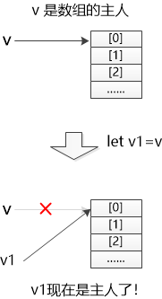
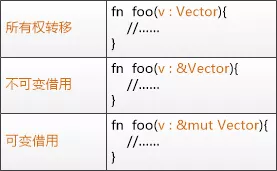
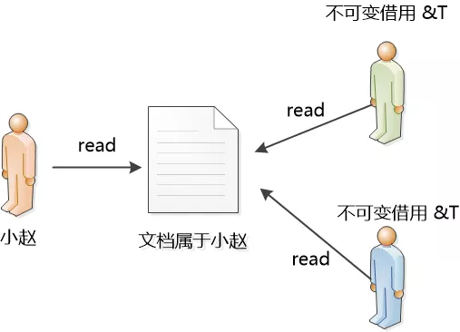
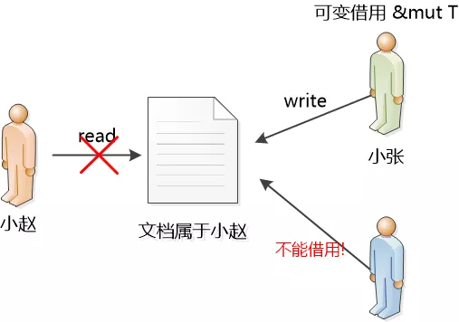

# Rust

## 所有权

 - Rust编译器：对于任何给定的对象都只有一个绑定与之对应。
    - 
 - 怎么把 v 传递给另外一个函数呢?
    - 借用 (&v), 临时借给其他函数
    - 类似java中的 引用
 - recap 
    - 
 - 同一时刻，
    - 要么只有一个可变（&mut）借用，
    - 要么有多个不可变（&) 借用，
    - 不能同时存在可变和不可变借用。 
    - 没有人希望 自己在读的时候，对象被别人改变了。
    - 
    - 
 - 当大家都在读一个东西的时候，是不能写的。当一个人在写的时候，别人是不能读的。
    - 经典的读写锁问题, Rust在编译器级别做了限制.


## Grammar

### String 

 - String literals ( static str )
    -
    ```rust
    let x: &str = "hello world!";
    ```
 - A heap-allocated string
    -
    ```rust
    let s: String = "hello world".to_string();
    ```
 - A string slice – an immutable view into another string
    -
    ```rust
    let s_slice: &str = &s;
    println!("{} {}", s, s_slice); // hello world hello world
    ```
    - This is basically an immutable pair of pointers to a string


### Vectors/arrays

 - A fixed-size array
    -
    ```rust
    let four_ints: [i32; 4] = [1, 2, 3, 4];
    ```
 - A dynamic array (vector)
    -
    ```rust
    let mut vector: Vec<i32> = vec![1, 2, 3, 4];
    vector.push(5);
    ```
 - A slice – an immutable view into a vector or array
    -
    ```rust
    let slice: &[i32] = &vector;
    // Use `{:?}` to print something debug-style
    println!("{:?} {:?}", vector, slice); // [1, 2, 3, 4, 5] [1, 2, 3, 4, 5]
    ```

### Tuples 

 - A fixed-size set of values of possibly different types
    -
    ```rust
    let x: (i32, &str, f64) = (1, "hello", 3.4);
    ```
 - Destructuring `let`
    -
    ```rust
    let (a, b, c) = x;
    ```
 - Indexing
    -
    ```rust
    println!("{}", x.1); // hello
    ```


### Struct

```rust
struct Point {
    x: i32,
    y: i32,
}

let origin: Point = Point { x: 0, y: 0 };
```

 - A struct with unnamed fields, called a ‘tuple struct’
    -
    ```rust
    struct Point2(i32, i32);
    let origin2 = Point2(0, 0);
    ```

### Enum

- Basic C-like enum
    -
    ```rust
    enum Direction {
        Left,
        Right,
        Up,
        Down,
    }

    let up = Direction::Up;
    ```
- Enum with fields
    -
    ```rust
    enum OptionalI32 {
        AnI32(i32),
        Nothing,
    }
    let two: OptionalI32 = OptionalI32::AnI32(2);
    let nothing = OptionalI32::Nothing;
    ```

### Generics

```rust
struct Foo<T> { bar: T }

// This is defined in the standard library as `Option`
enum Optional<T> {
    SomeVal(T),
    NoVal,
}
```

### Methods

```rust
impl<T> Foo<T> {
    // Methods take an explicit `self` parameter
    fn get_bar(self) -> T {
        self.bar
    }
}

let a_foo = Foo { bar: 1 };
println!("{}", a_foo.get_bar()); // 1
```

### Traits (Interface)

known as interfaces or typeclasses in other languages.

```rust
trait Frobnicate<T> {
    fn frobnicate(self) -> Option<T>;
}
```

- implement trait
    -
    ```rust
    impl<T> Frobnicate<T> for Foo<T> {
        fn frobnicate(self) -> Option<T> {
            Some(self.bar)
        }
    }
    let another_foo = Foo { bar: 1 };
    println!("{:?}", another_foo.frobnicate()); // Some(1)
    ```

### Pattern matching

```rust
let foo = OptionalI32::AnI32(1);
match foo {
    OptionalI32::AnI32(n) => println!("it’s an i32: {}", n),
    OptionalI32::Nothing  => println!("it’s nothing!"),
}
```

<details>
<summary>
Advanced pattern matching
</summary>

```rust
struct FooBar { x: i32, y: OptionalI32 }
let bar = FooBar { x: 15, y: OptionalI32::AnI32(32) };

match bar {
    FooBar { x: 0, y: OptionalI32::AnI32(0) } =>
        println!("The numbers are zero!"),
    FooBar { x: n, y: OptionalI32::AnI32(m) } if n == m =>
        println!("The numbers are the same"),
    FooBar { x: n, y: OptionalI32::AnI32(m) } =>
        println!("Different numbers: {} {}", n, m),
    FooBar { x: _, y: OptionalI32::Nothing } =>
        println!("The second number is Nothing!"),
}
```

</details>


### Control flow

 - `for` loops/iteration
    -
    ```rust
    let array = [1, 2, 3];
    for i in array.iter() {
        println!("{}", i);
    }
    ```
 - Ranges
    -
    ```rust
    for i in 0u32..10 {
        print!("{} ", i);
    }
    println!(""); // prints `0 1 2 3 4 5 6 7 8 9 `
    ```
 - if
    -
    ```rust
    if n < 0 {
        print!("{} is negative", n);
    } else if n > 0 {
        print!("{} is positive", n);
    } else {
        print!("{} is zero", n);
    }
    ```
 - if as expression
    -
    ```rust
    let value = if true {
        "good"
    } else {
        "bad"
    };
    ```
 - `while` loop
    -
    ```rust
    while 1 == 1 {
        println!("The universe is operating normally.");
        // break statement gets out of the while loop.
        //  It avoids useless iterations.
        break
    }
    ```
 - Infinite loop
    -
    ```rust
    loop {
        println!("Hello!");
        // break statement gets out of the loop
        break
    }
    ```

## Memory safety & pointers

 - 
```rust
let mut mine: Box<i32> = Box::new(3);
*mine = 5; // dereference
```
 - Owned pointer
    - only one thing can ‘own’ this pointer at a time
    - This means that when the `Box` leaves its scope, it can be automatically deallocated safely. 
 - 
```rust
let mut now_its_mine = mine;
*now_its_mine += 2;
```
 - Here, `now_its_mine` takes ownership of `mine`. In other words, `mine` is moved.


